# Terraform — Complete Guide

A deep-dive into what Terraform is, why it exists, the real-world problems it solves, and every core concept you need to use it confidently.

---

## Table of Contents

1. [What is Terraform](#1-what-is-terraform)
2. [Why We Use Terraform](#2-why-we-use-terraform)
3. [Real-World Problems Terraform Solves](#3-real-world-problems-terraform-solves)
4. [How Terraform Works (Architecture)](#4-how-terraform-works-architecture)
5. [Terraform Lifecycle](#5-terraform-lifecycle)
6. [Core Concepts in Detail](#6-core-concepts-in-detail)
   - [Providers](#61-providers)
   - [Resources](#62-resources)
   - [Data Sources](#63-data-sources)
   - [Variables](#64-variables)
   - [Outputs](#65-outputs)
   - [State](#66-state)
   - [Backend](#67-backend)
   - [Modules](#68-modules)
   - [Provisioners](#69-provisioners)
   - [Workspaces](#610-workspaces)
   - [Terraform Graph (Dependency Resolution)](#611-terraform-graph-dependency-resolution)
7. [Terraform Commands Cheat Sheet](#7-terraform-commands-cheat-sheet)
8. [End-to-End Example](#8-end-to-end-example)
9. [Best Practices](#9-best-practices)

---

## 1. What is Terraform

**Terraform** is an open-source **Infrastructure as Code (IaC)** tool created by HashiCorp. It lets you define cloud and on-prem infrastructure — servers, networks, databases, load balancers, DNS records, permissions, and more — using a declarative configuration language called **HCL (HashiCorp Configuration Language)**.

Instead of manually clicking through a cloud console (AWS Console, Azure Portal, GCP Console) to create resources, you **write code that describes the desired end state** of your infrastructure, and Terraform figures out how to make reality match that description.

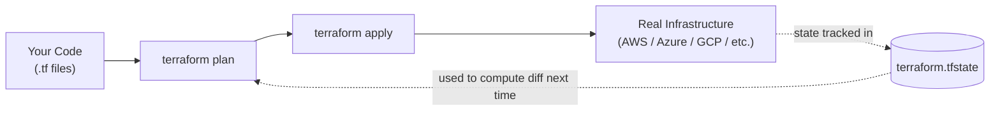

Key traits:
- **Declarative**: you describe *what* you want, not the steps to get there.
- **Provider-agnostic**: works with 3000+ providers (AWS, Azure, GCP, Kubernetes, Datadog, GitHub, Cloudflare, etc.) through a single workflow.
- **Idempotent**: running the same configuration multiple times results in the same infrastructure state — it won't recreate things that already exist correctly.
- **Stateful**: it keeps a record (the "state file") of what it has created, so it knows what to add, change, or delete.

---

## 2. Why We Use Terraform

| Without Terraform | With Terraform |
|---|---|
| Engineers manually create resources via console/CLI | Infrastructure is defined in version-controlled code |
| No record of *why* something exists | Git history explains every change |
| Hard to replicate an environment (dev/stage/prod drift) | Same code deploys identical environments |
| Fear of touching production ("if it ain't broke...") | `terraform plan` shows exact changes before applying |
| Manual cleanup after testing (forgotten resources cost money) | `terraform destroy` removes everything cleanly |
| Vendor lock-in to one cloud's tooling (CloudFormation only works on AWS) | One tool, one language, many clouds |
| Onboarding a new engineer takes days of tribal knowledge | `git clone` + `terraform apply` reproduces the whole stack |

In short: Terraform turns infrastructure management from a **manual, error-prone, undocumented process** into a **repeatable, reviewable, automatable engineering practice** — the same discipline we already apply to application code.

---

## 3. Real-World Problems Terraform Solves

### Problem 1: "Works on my environment" / Configuration Drift
Manually configured servers slowly diverge from each other because different people made different tweaks over time. Terraform enforces that infrastructure always matches what's in code — if someone manually changes something in the console, the next `terraform plan` detects and flags that **drift**.

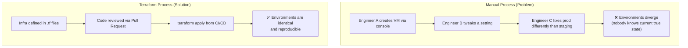

### Problem 2: Disaster Recovery
If a data center region goes down or someone accidentally deletes a resource, rebuilding manually can take days. With Terraform, you run `terraform apply` against the same code and the entire environment is rebuilt in minutes.

### Problem 3: Multi-Cloud / Multi-Environment Consistency
Companies often need dev, staging, and production to be identical (just scaled differently). Terraform modules let you reuse the exact same infrastructure blueprint across environments and even across cloud providers.

### Problem 4: Auditability and Compliance
Every infrastructure change is a Git commit — who changed what, when, and why (via PR description). This is critical for SOC2, ISO27001, and other compliance audits.

### Problem 5: Collaboration at Scale
Multiple engineers changing shared infrastructure manually leads to conflicts and outages. Terraform's **state locking** (via remote backends like S3+DynamoDB) prevents two people from applying changes simultaneously and corrupting infrastructure.

### Problem 6: Cost and Resource Sprawl
Forgotten test resources ("oops, left that EC2 instance running for 6 months") are a common cause of cloud bill shock. `terraform destroy` cleanly tears down everything defined in the code, and code review makes it obvious what's being created.

---

## 4. How Terraform Works (Architecture)

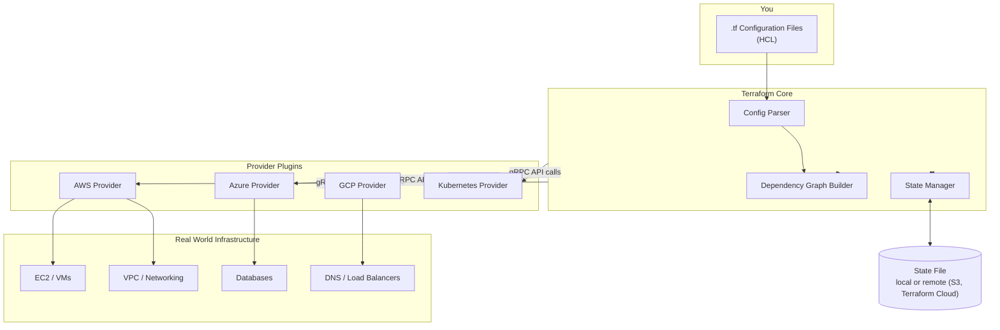

- **Terraform Core**: reads your `.tf` files, builds a dependency graph, and determines the order of operations.
- **Providers**: plugins that translate Terraform's generic resource actions (create/read/update/delete) into actual API calls for a specific platform (AWS SDK calls, Azure REST API calls, etc.).
- **State File**: a JSON file that maps your configuration to real-world resource IDs, so Terraform knows what already exists.

---

## 5. Terraform Lifecycle

The Terraform **workflow lifecycle** has 5 core stages, usually run in this order:

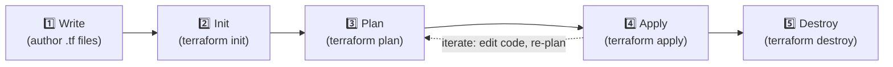

### Stage 1 — Write
You author `.tf` files describing resources, using HCL syntax.

```hcl
resource "aws_instance" "web_server" {
  ami           = "ami-0c101f26f147fa7fd"
  instance_type = "t2.micro"

  tags = {
    Name = "MyWebServer"
  }
}
```

### Stage 2 — Init (`terraform init`)
- Downloads the provider plugins referenced in your config (e.g., the AWS provider).
- Sets up the backend (where state will be stored).
- Initializes any modules referenced.

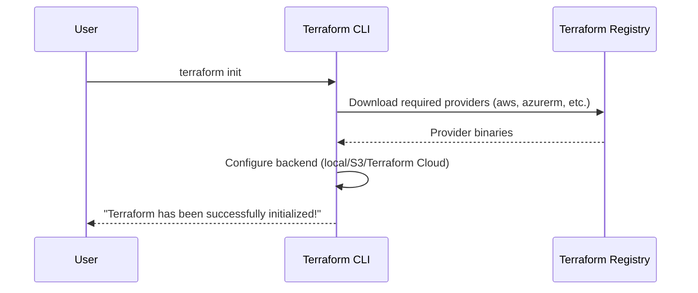

### Stage 3 — Plan (`terraform plan`)
Terraform compares your **desired state** (the code) against the **current state** (the state file + real infra) and shows an execution plan: what will be **added (+)**, **changed (~)**, or **destroyed (-)** — without actually doing it.

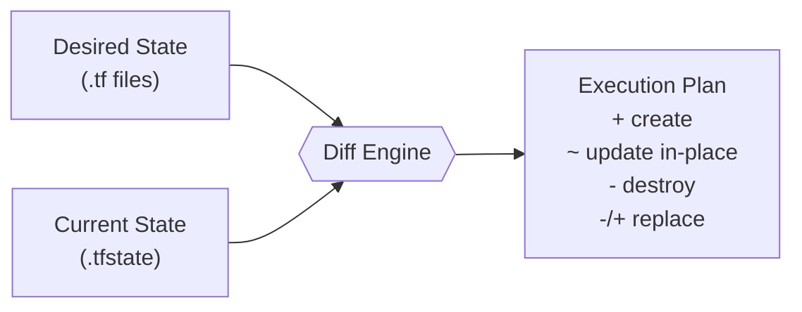

Example plan output:
```
  # aws_instance.web_server will be created
  + resource "aws_instance" "web_server" {
      + ami           = "ami-0c101f26f147fa7fd"
      + instance_type = "t2.micro"
      + id            = (known after apply)
    }

Plan: 1 to add, 0 to change, 0 to destroy.
```

### Stage 4 — Apply (`terraform apply`)
Executes the plan: calls the provider APIs to actually create/update/delete resources, and **updates the state file** to reflect the new reality.

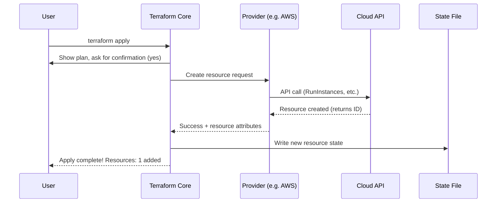

### Stage 5 — Destroy (`terraform destroy`)
Removes all resources tracked in the state file, in reverse dependency order (so, e.g., an EC2 instance is destroyed before the VPC it lives in).

> 💡 The lifecycle is **iterative**: after the first apply, you keep editing code → plan → apply as requirements change. Terraform always diffs against current state, so subsequent applies are incremental (only the delta is changed).

---

## 6. Core Concepts in Detail

### 6.1 Providers

A **provider** is a plugin that lets Terraform manage a specific platform's resources (AWS, Azure, GCP, Kubernetes, GitHub, Datadog, etc.). You declare which providers you need at the top of your configuration.

```hcl
terraform {
  required_providers {
    aws = {
      source  = "hashicorp/aws"
      version = "~> 5.0"
    }
  }
}

provider "aws" {
  region = "ap-south-1"
}
```

You can even use **multiple instances of the same provider** (e.g., to manage resources in two AWS regions) using `alias`:

```hcl
provider "aws" {
  alias  = "us_east"
  region = "us-east-1"
}

resource "aws_instance" "backup_server" {
  provider      = aws.us_east
  ami           = "ami-123456"
  instance_type = "t2.micro"
}
```

### 6.2 Resources

A **resource** is the fundamental building block — it represents one infrastructure object (a VM, a database, a DNS record, an IAM role).

Syntax: `resource "<PROVIDER_TYPE>" "<LOCAL_NAME>" { ... }`

```hcl
resource "aws_s3_bucket" "app_data" {
  bucket = "my-company-app-data-bucket"

  tags = {
    Environment = "production"
    Team        = "platform"
  }
}
```

`aws_s3_bucket` is the resource **type**; `app_data` is the **local name** you use to reference it elsewhere, e.g. `aws_s3_bucket.app_data.arn`.

### 6.3 Data Sources

A **data source** lets you **read** information about existing infrastructure that Terraform did *not* create — useful for referencing resources managed elsewhere.

```hcl
data "aws_ami" "latest_amazon_linux" {
  most_recent = true
  owners      = ["amazon"]

  filter {
    name   = "name"
    values = ["amzn2-ami-hvm-*-x86_64-gp2"]
  }
}

resource "aws_instance" "web" {
  ami           = data.aws_ami.latest_amazon_linux.id
  instance_type = "t2.micro"
}
```

### 6.4 Variables

**Input variables** parameterize your configuration so it's reusable across environments.

```hcl
variable "instance_type" {
  description = "EC2 instance type"
  type        = string
  default     = "t2.micro"
}

variable "environment" {
  type = string
}

resource "aws_instance" "web" {
  ami           = "ami-0c101f26f147fa7fd"
  instance_type = var.instance_type

  tags = {
    Environment = var.environment
  }
}
```

You supply values via:
```bash
terraform apply -var="environment=production"
# or a .tfvars file:
terraform apply -var-file="prod.tfvars"
```

`prod.tfvars`:
```hcl
environment   = "production"
instance_type = "t3.large"
```

### 6.5 Outputs

**Outputs** expose values from your infrastructure — useful for chaining modules together or displaying important info after apply (like an IP address or connection string).

```hcl
output "instance_public_ip" {
  description = "Public IP of the web server"
  value       = aws_instance.web.public_ip
}
```

```bash
$ terraform apply
...
Outputs:
instance_public_ip = "3.110.45.201"
```

### 6.6 State

The **state file** (`terraform.tfstate`) is a JSON snapshot mapping your `.tf` resource blocks to real-world resource IDs and their current attributes. This is how Terraform knows what already exists, and what needs to change.

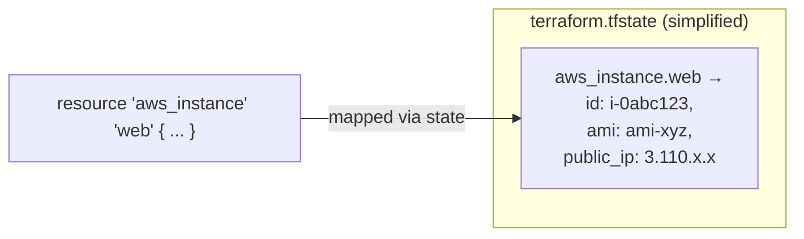

Why state matters:
- **Performance**: Terraform doesn't need to query every cloud API on every run — it trusts the state as a cache (then verifies via refresh).
- **Mapping**: connects abstract config blocks to concrete resource IDs (e.g., `i-0abc123`).
- **Metadata**: tracks resource dependencies for correct create/destroy ordering.

⚠️ **State contains sensitive data** (passwords, keys) in plaintext by default — never commit it to Git. Use a secure remote backend instead.

### 6.7 Backend

A **backend** determines *where* the state file is stored and how operations are executed.

| Backend Type | Description |
|---|---|
| `local` (default) | State stored as a file on your local disk — fine for solo learning, bad for teams |
| `s3` (+ DynamoDB) | State in an S3 bucket, with DynamoDB for state locking — classic AWS team setup |
| `azurerm` | State in an Azure Storage Account |
| `remote` / Terraform Cloud | HashiCorp-managed state storage, locking, and even remote plan/apply execution |

```hcl
terraform {
  backend "s3" {
    bucket         = "my-terraform-state-bucket"
    key            = "prod/network/terraform.tfstate"
    region         = "ap-south-1"
    dynamodb_table = "terraform-locks"
    encrypt        = true
  }
}
```

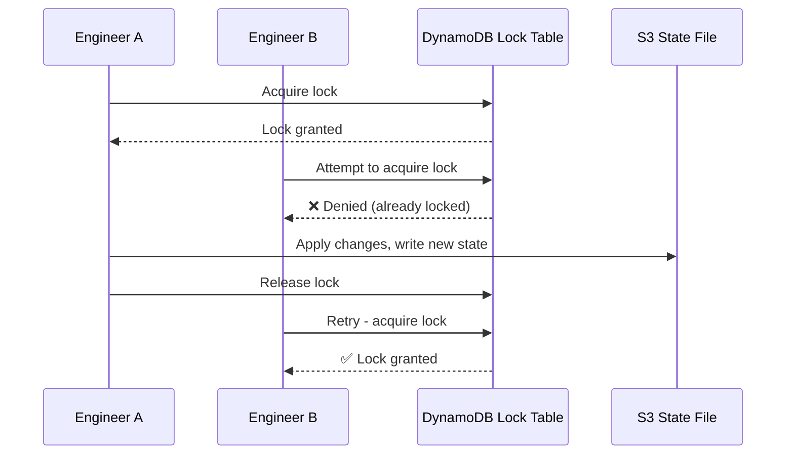

This prevents two engineers from corrupting state by applying at the same time.

### 6.8 Modules

A **module** is a reusable, self-contained package of `.tf` files — think of it like a function in programming. The **root module** is your main working directory; you can call **child modules** from it.

```
modules/
└── ec2-instance/
    ├── main.tf
    ├── variables.tf
    └── outputs.tf
main.tf          <- root module, calls the child module
```

`modules/ec2-instance/main.tf`:
```hcl
resource "aws_instance" "this" {
  ami           = var.ami_id
  instance_type = var.instance_type
  tags          = { Name = var.name }
}
```

`modules/ec2-instance/variables.tf`:
```hcl
variable "ami_id"        { type = string }
variable "instance_type" { type = string }
variable "name"          { type = string }
```

Root `main.tf` — reusing the module for dev and prod:
```hcl
module "dev_server" {
  source        = "./modules/ec2-instance"
  ami_id        = "ami-0c101f26f147fa7fd"
  instance_type = "t2.micro"
  name          = "dev-server"
}

module "prod_server" {
  source        = "./modules/ec2-instance"
  ami_id        = "ami-0c101f26f147fa7fd"
  instance_type = "t3.large"
  name          = "prod-server"
}
```

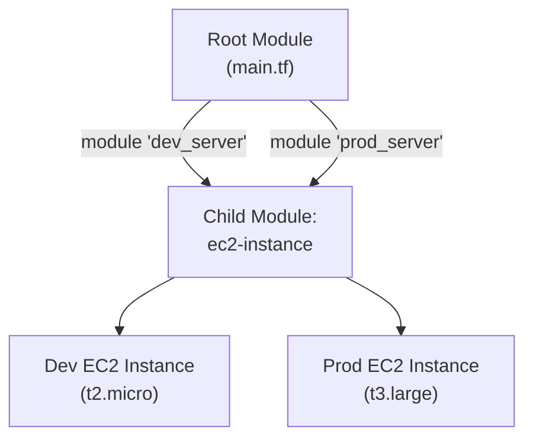

This is how companies achieve **consistency**: one vetted module, reused everywhere, with only inputs varying.

### 6.9 Provisioners

**Provisioners** run scripts/commands on a resource after creation (or before destruction) — used sparingly, as a last resort, when a provider doesn't natively support something (e.g., bootstrapping software on a VM).

```hcl
resource "aws_instance" "web" {
  ami           = "ami-0c101f26f147fa7fd"
  instance_type = "t2.micro"

  provisioner "remote-exec" {
    inline = [
      "sudo apt-get update",
      "sudo apt-get install -y nginx"
    ]
  }
}
```

> ⚠️ HashiCorp recommends provisioners as a **last resort** — prefer cloud-init, user-data scripts, or configuration management tools (Ansible, Chef) where possible, since provisioners aren't tracked well by Terraform's plan/diff engine.

### 6.10 Workspaces

**Workspaces** let you maintain multiple distinct state files from the *same* configuration — useful for quick environment separation without duplicating code.

```bash
terraform workspace new dev
terraform workspace new staging
terraform workspace new prod

terraform workspace select prod
terraform apply
```

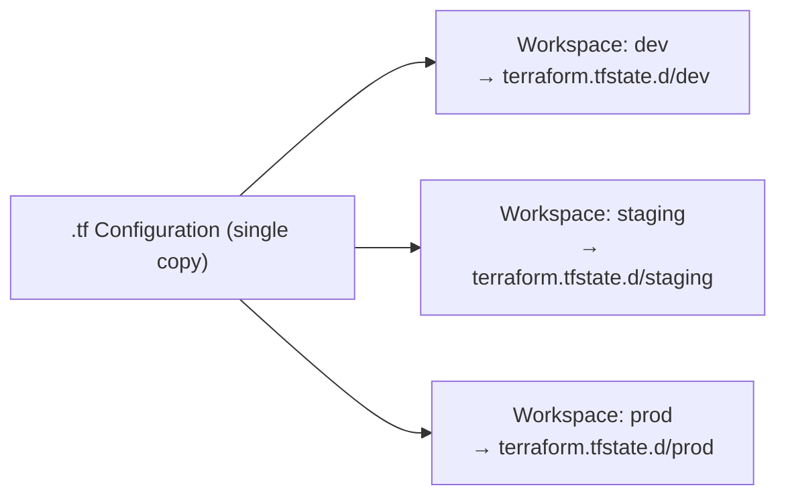

> Note: For serious environment separation (different account, different approval process), most teams prefer **separate root modules / separate state backends per environment** rather than workspaces, since workspaces share the same backend config and are easy to apply to the wrong one by mistake.

### 6.11 Terraform Graph (Dependency Resolution)

Terraform automatically figures out the order to create/update/destroy resources by building a **Directed Acyclic Graph (DAG)** from implicit and explicit dependencies (e.g., a subnet must exist before an EC2 instance can be placed in it).

```hcl
resource "aws_vpc" "main" {
  cidr_block = "10.0.0.0/16"
}

resource "aws_subnet" "public" {
  vpc_id     = aws_vpc.main.id   # <-- implicit dependency
  cidr_block = "10.0.1.0/24"
}

resource "aws_instance" "web" {
  subnet_id = aws_subnet.public.id  # <-- implicit dependency
  ami       = "ami-xyz"
  instance_type = "t2.micro"
}
```

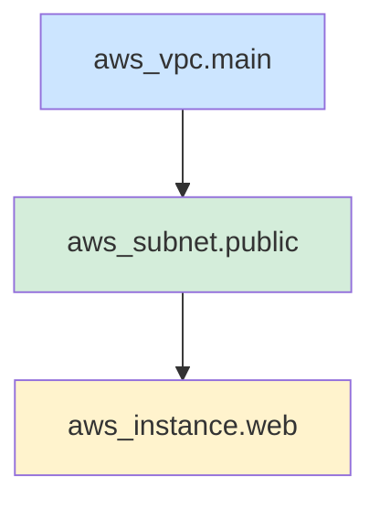

Terraform creates resources **bottom-up** (VPC → Subnet → Instance) and destroys them **top-down** (Instance → Subnet → VPC) — always respecting dependency order, and running independent resources **in parallel** for speed.

---

## 7. Terraform Commands Cheat Sheet

| Command | Purpose |
|---|---|
| `terraform init` | Initialize working directory, download providers/modules |
| `terraform validate` | Check configuration syntax is valid |
| `terraform fmt` | Auto-format `.tf` files to canonical style |
| `terraform plan` | Show execution plan (dry run) |
| `terraform apply` | Apply changes to reach desired state |
| `terraform destroy` | Destroy all managed infrastructure |
| `terraform state list` | List all resources tracked in state |
| `terraform state show <resource>` | Show attributes of a specific resource |
| `terraform import <addr> <id>` | Bring an existing, manually-created resource under Terraform management |
| `terraform taint <resource>` | Mark a resource for forced recreation on next apply |
| `terraform workspace list` | List available workspaces |
| `terraform output` | Print output values |
| `terraform graph` | Generate a visual dependency graph (DOT format) |

---

## 8. End-to-End Example

A minimal but complete example: a VPC, subnet, security group, and an EC2 instance.

```hcl
# main.tf
terraform {
  required_providers {
    aws = {
      source  = "hashicorp/aws"
      version = "~> 5.0"
    }
  }
}

provider "aws" {
  region = var.aws_region
}

resource "aws_vpc" "main" {
  cidr_block           = "10.0.0.0/16"
  enable_dns_hostnames = true
  tags = { Name = "${var.project_name}-vpc" }
}

resource "aws_subnet" "public" {
  vpc_id                  = aws_vpc.main.id
  cidr_block              = "10.0.1.0/24"
  map_public_ip_on_launch = true
  tags = { Name = "${var.project_name}-public-subnet" }
}

resource "aws_security_group" "web_sg" {
  name   = "${var.project_name}-web-sg"
  vpc_id = aws_vpc.main.id

  ingress {
    from_port   = 80
    to_port     = 80
    protocol    = "tcp"
    cidr_blocks = ["0.0.0.0/0"]
  }

  egress {
    from_port   = 0
    to_port     = 0
    protocol    = "-1"
    cidr_blocks = ["0.0.0.0/0"]
  }
}

resource "aws_instance" "web" {
  ami                    = data.aws_ami.amazon_linux.id
  instance_type          = var.instance_type
  subnet_id              = aws_subnet.public.id
  vpc_security_group_ids = [aws_security_group.web_sg.id]

  tags = { Name = "${var.project_name}-web" }
}

data "aws_ami" "amazon_linux" {
  most_recent = true
  owners      = ["amazon"]
  filter {
    name   = "name"
    values = ["amzn2-ami-hvm-*-x86_64-gp2"]
  }
}
```

```hcl
# variables.tf
variable "aws_region"    { default = "ap-south-1" }
variable "project_name"  { default = "demo" }
variable "instance_type" { default = "t2.micro" }
```

```hcl
# outputs.tf
output "web_public_ip" {
  value = aws_instance.web.public_ip
}
```

Run it:
```bash
terraform init
terraform plan
terraform apply -auto-approve
# ... use the infrastructure ...
terraform destroy -auto-approve
```

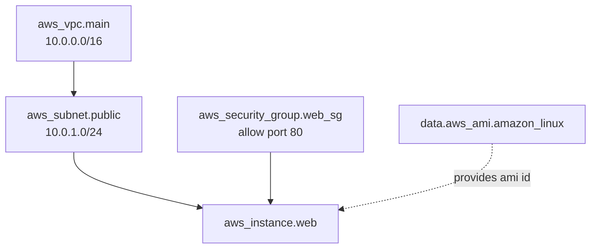

---

## 9. Best Practices

- ✅ **Always run `terraform plan` before `apply`** — never apply blind, especially in production.
- ✅ **Use remote state with locking** (S3+DynamoDB, Terraform Cloud) for any team environment.
- ✅ **Never commit `.tfstate` or `.tfvars` with secrets to Git** — add them to `.gitignore`.
- ✅ **Pin provider and module versions** (`~> 5.0`) to avoid unexpected breaking changes.
- ✅ **Use modules** to avoid copy-pasting the same resource blocks across environments.
- ✅ **Separate state per environment/team** (e.g., `network/`, `app/`, `database/` as separate root modules) so a mistake in one blast radius doesn't affect everything.
- ✅ **Use a CI/CD pipeline** (Atlantis, Terraform Cloud, GitHub Actions) to run `plan` on PRs and `apply` on merge — never apply from a random laptop.
- ✅ **Use `terraform fmt` and `terraform validate`** as pre-commit hooks.
- ✅ **Tag every resource** (environment, owner, cost-center) for cost tracking and accountability.
- ❌ **Avoid provisioners** unless truly necessary — prefer native provider features or user-data/cloud-init.

---

### Summary

Terraform replaces manual, undocumented, drift-prone infrastructure changes with **declarative, version-controlled, reviewable, and repeatable** infrastructure code. Its lifecycle — **Write → Init → Plan → Apply → Destroy** — combined with core concepts like **providers, resources, state, modules, and backends**, gives teams a single consistent workflow to manage infrastructure across any cloud, safely and at scale.
