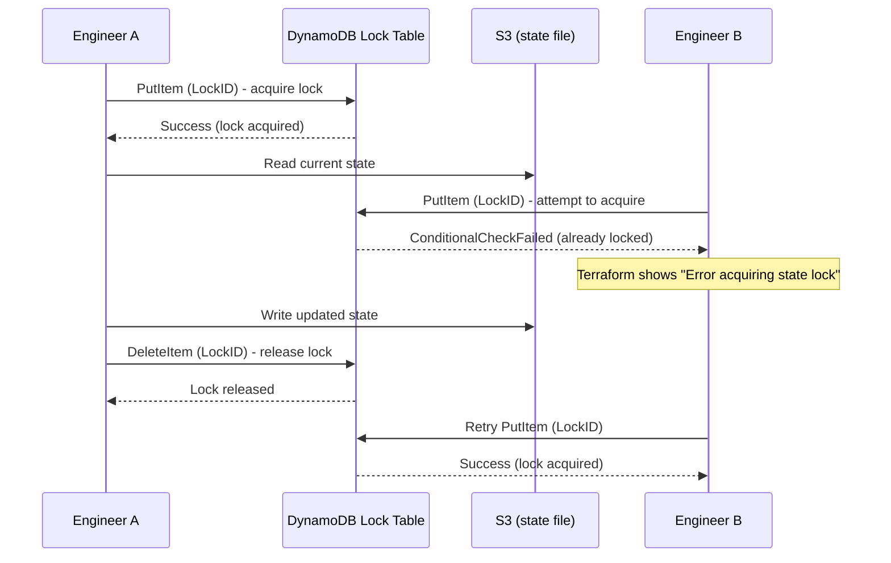

# Terraform State Locking

## The Problem: Concurrent Writes

Imagine two engineers, both working on the same infrastructure, both running `terraform apply` at nearly the same moment:

```
Time  Engineer A                      Engineer B
────  ───────────────────────────     ───────────────────────────
t0    reads state (serial: 5)         reads state (serial: 5)
t1    plans: add subnet               plans: add security group
t2    applies: creates subnet         applies: creates security group
t3    writes state (serial: 6)        writes state (serial: 6)  <- OVERWRITES A's changes!
```

Both engineers read the *same starting state*, made *different* real-world changes, but only the **last write wins** when saving state. Engineer B's write completely overwrites Engineer A's — so Terraform's state file no longer reflects reality; it "forgets" the subnet Engineer A created (even though it still physically exists in AWS). This is called **state corruption**, and it's one of the most disruptive things that can happen to a Terraform-managed environment — future plans get confused, and you may end up with orphaned or duplicate resources.

## The Solution: Locking

A **lock** ensures only **one** Terraform operation (`plan`, `apply`, `destroy`, or anything that could write state) can run against a given state file at a time. Anyone else attempting to run Terraform against that same state is blocked until the lock is released.

```
Engineer A                    Lock Table                    Engineer B
──────────                    ───────────                   ──────────
terraform apply  ──────────►  🔒 LOCKED by A
                                                              terraform apply
                                                              ───────────────►
                                                              ❌ Error: state locked
                                                                 (waits or fails)
...applies changes...
terraform apply completes ──► 🔓 UNLOCKED
                                                              🔒 LOCKED by B
                                                              ...proceeds now...
```

If Engineer B tries to run `apply` while A holds the lock, they see:
```
Error: Error acquiring the state lock

Lock Info:
  ID:        e5b8f7a2-1234-5678-9abc-def012345678
  Path:      my-company-terraform-state/projects/webapp/terraform.tfstate
  Operation: OperationTypeApply
  Who:       engineer-a@dev-machine
  Version:   1.9.8
  Created:   2026-09-13 10:15:32 UTC
```

This is actually helpful — it tells B exactly who is holding the lock and since when, so they know to wait (or investigate if it looks stuck).

## How Locking Works with S3 + DynamoDB

The S3 backend itself doesn't support locking natively — S3 is just object storage. So the classic AWS setup pairs S3 (state storage) with **DynamoDB** (a fast key-value database) purely to act as a lock manager.



Mechanically:
1. Before any state-modifying operation, Terraform writes an item to the DynamoDB table using the state file's S3 path as the unique `LockID`.
2. DynamoDB's **conditional write** feature ensures this only succeeds if no lock item already exists for that `LockID` — this is atomic, so there's no race condition even if two requests arrive at nearly the same instant.
3. If the write succeeds, Terraform proceeds and holds the lock for the duration of the operation.
4. When the operation finishes (or fails), Terraform deletes the lock item, freeing it up for the next request.

### Required DynamoDB table schema
```hcl
resource "aws_dynamodb_table" "terraform_locks" {
  name         = "terraform-locks"
  billing_mode = "PAY_PER_REQUEST"
  hash_key     = "LockID"

  attribute {
    name = "LockID"
    type = "S"
  }
}
```
The table needs **exactly one attribute**: a string partition key named `LockID`. That's it — Terraform manages all the read/write logic itself.

## What If a Lock Gets "Stuck"?

If Terraform crashes mid-operation (e.g., your laptop loses power, or a CI job gets killed) before it releases the lock, the lock item can be left behind in DynamoDB even though no one is actually running Terraform anymore.

Terraform provides an escape hatch:
```bash
terraform force-unlock <LOCK_ID>
```
You get the `LOCK_ID` from the error message shown when someone else tries to run Terraform. **Only use this when you're certain no other operation is actually in progress** — force-unlocking while someone is genuinely applying can cause the exact corruption locking was meant to prevent.

## Locking Beyond S3+DynamoDB

- **Terraform Cloud / Enterprise**: locking is built in automatically — no separate lock table needed.
- **Azure (`azurerm` backend)**: uses native **blob lease** functionality on the storage container — no extra resource required.
- **GCS backend**: uses native **object versioning + generation preconditions** — also no extra resource required.

S3 is the outlier that needs an explicit companion resource (DynamoDB) purely because S3 itself has no native locking primitive.

## Key Takeaways

- Locking prevents two simultaneous Terraform runs from corrupting shared state.
- With S3, this requires a **DynamoDB table** as a companion resource.
- Locks are automatic — you don't manually lock/unlock in normal usage; Terraform handles it around every state-modifying command.
- `force-unlock` exists for recovery, but should be used cautiously.

## Next
Read [`s3-backend.md`](./s3-backend.md) for the full step-by-step setup of an S3 + DynamoDB remote backend, then try the working code in [`examples/remote-backend/`](./examples/remote-backend/).
